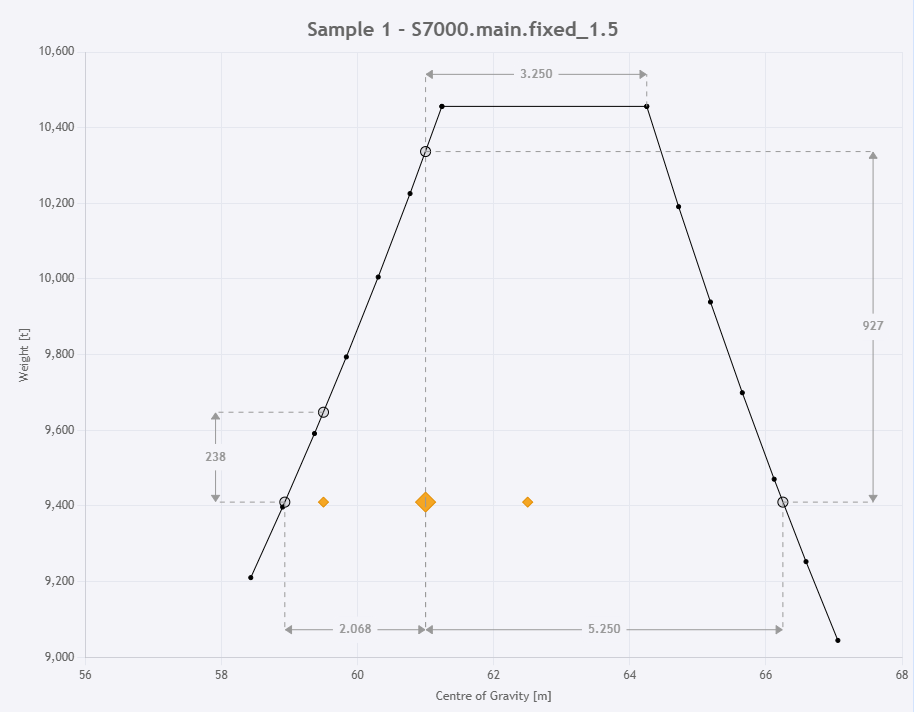

# dual_crane_lift_capacity

Browser-based tool for evaluating dual crane lift capacity envelopes.



The plot illustrates the limiting load and transverse CoG positions for which at least one crane operates at full capacity. The object’s actual weight and CoG are also shown, together with the available reserve capacity.

## 🌐 Run
### GitHub Pages
The latest deployed version is available at:

https://akjore.github.io/dual_crane_lift_capacity/

### Run locally
Clone the repository, start a simple web server, and open the app in your browser.
```bash
git clone https://github.com/akjore/dual_crane_lift_capacity.git
cd dual_crane_lift_capacity/webapp
python -m http.server 5000
```

Then open: http://localhost:5000

### Configuration
Create a `.env` file in the project root and set:
```bash
CRANE_CURVE_FILE=/path/to/your/crane_curves.yaml
```

This file should contain the crane curve definitions required by the backend.

## 🧪 Tests
Run the test suite with:
```bash
python -m pytest
```

## 💻 Command-line usage - TODO
You can also run the tool directly from the command line:
```bash
python -m dual_crane_lift_capacity.dual_crane_lift -i path/to/sample/input/file
```

## 📄 Sample input
A sample YAML file is provided in the webapp directory. This can be:

- Downloaded from the web UI
- Modified locally
- Re-uploaded into the application


## ⚠️ Notes

- The web application runs entirely in the browser (via Pyodide)
- Ensure your browser allows loading local resources when running locally
- For development, rebuilding the Python wheel may be required

## 🛠 Development

Build wheel:
```
python -m build --wheel --no-isolation --outdir webapp/wheels
```

## 🧠 Architecture

- Frontend: JavaScript
- Backend: Python via Pyodide
- Packaging: Wheel loaded in-browser
